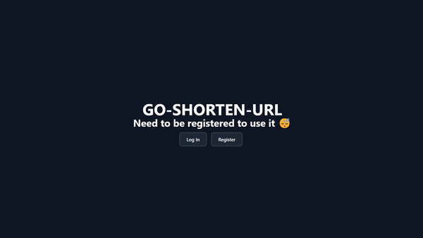
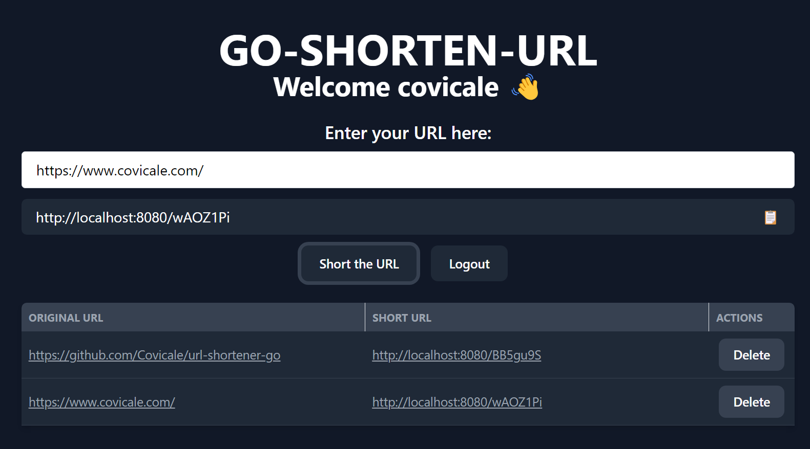

# URL Shortener GO



[](https://img.shields.io/github/last-commit/covicale/url-shortener-go)
[](https://img.shields.io/github/issues-raw/covicale/url-shortener-go)
[](https://img.shields.io/github/issues-pr/covicale/url-shortener-go)
[](https://img.shields.io/github/license/covicale/url-shortener-go)

URL Shortener GO is a simple URL shortener project written in Go. It uses a PostgreSQL database to store the shortened URLs and native net/http package to handle the requests.

This project uses JWT for authentication and authorization. The frontend is plain HTML, CSS, and JavaScript with no frameworks or libraries, to keep it simple and focus on the backend.

# Table of Contents

- [URL Shortener GO](#url-shortener-go)
- [Table of Contents](#table-of-contents)
- [Installation](#installation)
  - [Docker Compose](#docker-compose)
  - [Manual Installation](#manual-installation)
- [Usage](#usage)
- [License](#license)

# Installation

First of all, you need to clone the project to your local machine.

```shell
git clone https://github.com/Covicale/url-shortener-go.git
```

After the cloning is complete, you need set the environment variables.

In the project, you will find a `.env.demo` file. You need to rename this file to `.env` and update the values according to your environment.

There are two ways to install this project: With docker-compose or manual installation.

## Docker Compose

You can use the provided `docker-compose.yml` file to run the project with a single command.

```shell
docker-compose up
```

## Manual Installation

If you don't want to use Docker, you can install the project manually. Pre-requisites are Go and PostgreSQL:

- **Go**: 1.22 or higher
- **PostgreSQL**: 16 or higher

After launching the PostgreSQL server, you need to create a database and a user for the project. \
There is a `internal/db/schema/schema.sql` file. You can use this file to create the database.

Once the database is created, you can simply run the project with `make build && make run` if you have `make` installed. \
If you don't have `make` installed, you can run the project with the following commands:

```shell
go build -o url-shortener-go cmd/main.go
./url-shortener-go
```

# Usage

In your browser, navigate to `http://localhost:${PORT}` to see the URL Shortener GO in action. \

First, you need to register a new user. After registering, you can log in with your credentials. \

After logging in, you can shorten URLs and see the list of shortened URLs.



# License

[MIT license](./LICENSE)
